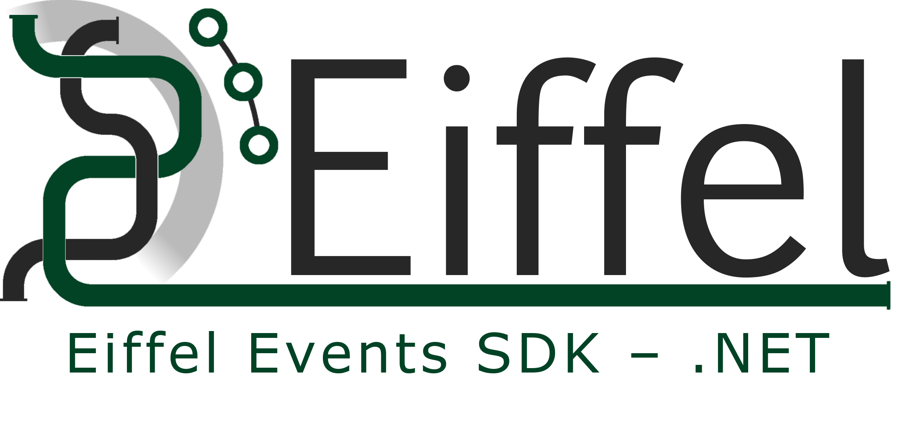

# EiffelEvents .NET SDK #

**EiffelEvents .NET SDK** is a .NET implementation for Eiffel events and  Assisted publishing service, which acts as an intermediate between the event author (publisher) and the Message Broker (RabbitMQ for instance).

EiffelEvents .NET SDK features include:

- Implement Eiffel events vocabularies as described in [Eiffel-edition-paris](https://github.com/eiffel-community/eiffel/tree/edition-paris) 
- Validate events' schema regarding target event’s version.
- Sign and verify events' signatures.
- Serialization/deserialization of events.
- Provide  APIs for users to publish, subscribe, acknowledge, reject and unsubscribe for strongly-typed Eiffel events to RabbitMQ.

It consists of two packages; 1) **EiffelEvents.Net** for events' implementation, 2) **EiffelEvents.RabbitMq.Client** for assisted publishing to RabbitMQ.


# Quick Start #

## Using Events Package ([src/EiffelEvents.Net](src/EiffelEvents.Net))

To get started install requirements then reference the events library, [src/EiffelEvents.Net](src/EiffelEvents.Net) in a project, then start using the events as follows:

```c#
// Use required namespaces
using System;
using EiffelEvents.Net.Events.Edition_Paris;
using EiffelEvents.Net.Events.Edition_Paris.Shared.Enums;

 // Declare event object
var activityTriggeredEvent = new EiffelActivityTriggeredEvent()
{
    Data = new ()
    {
        Name = "My activity",
        Categories = new () { "category 1", "category 2" },
        Triggers = new ()
        {
            new() { Type = EiffelDataTriggerType.SOURCE_CHANGE, Description = "Description" }
        },
        ExecutionType = EiffelDataExecutionType.AUTOMATED,
        CustomData = new ()
        {
            {"key1", "test"},
            {"key2", new[] { 1, 2, 3 }}
        }
    },
    Meta = new ()
    {
        Id = Guid.NewGuid().ToString(),
        Tags = new () { "activity_block" },
        Security = new ()
        {
            AuthorIdentity = "Flower"
        }
    },
    Links = new ()
    {
        Context = "82f11609-bd5b-4c82-a5f2-c2a9d982cdbd",
        FlowContext = new () { "cf056717-201b-43f6-9f2c-839b33b71baf" }
    }
};

// Validate the event according to schema
Result result = activityTriggeredEvent.Validate();
Console.WriteLine(result);

// Signing event
var signedEvent = activityTriggeredEvent.Sign<EiffelActivityTriggeredEvent>();

//Serializing event
var json = signedEvent.ToJson();
Console.WriteLine(json);
```


## Using Publishing Package ([src/EiffelEvents.RabbitMq.Client](src/EiffelEvents.RabbitMq.Client))

To get started install requirements then reference the events library, [src/EiffelEvents.RabbitMq.Client](src/EiffelEvents.RabbitMq.Client) in a project, then start processing using the publishing client.

Note: make sure that a RabbitMQ instance is up and running, then provide its configurations to `RabbitMqEiffelClient`

#### **Publisher sample**

```c#
// Use required namespaces
using EiffelEvents.RabbitMq.Client;

// Init client
IEiffelClient eiffelClient = new RabbitMqEiffelClient(new RabbitMqConfig
        {
            HostName = "localhost",
            UserName = "admin",
            Password = "admin",
            Port = 5672
        }, 1);
        
// Declare event as done in Using Events Package (src/EiffelEvents.Net) section
//...
// Signing event
var signedEvent = activityTriggeredEvent.Sign<EiffelActivityTriggeredEvent>();

// Publish event to RabbitMQ
var result = _eiffelClient.Publish(signedEvent);

//check the publishing result
Console.WriteLine(result);
```

#### **Subscriber sample**

```c#
// Init client
IEiffelClient eiffelClient = new RabbitMqEiffelClient(new RabbitMqConfig
        {
            HostName = "localhost",
            UserName = "admin",
            Password = "admin",
            Port = 5672
        }, 1);

// Subscribe to strongly-typed event, EiffelActivityTriggeredEvent
var subscriptionId = eiffelClient.Subscribe<EiffelActivityTriggeredEvent>(HandleEventReceived);
```

##### **Handle receiving an event** 

```c#
static void HandleEventReceived(Result<EiffelActivityTriggeredEvent> eiffelEventResult, ulong deliveryTag)
{
    Console.WriteLine("========= Callback called ========= ");
    Console.WriteLine($"Event Received {typeof(T).Name} \nDelivery Tag : {deliveryTag} \n========");
    if (eiffelEventResult.IsSuccess)
    {
        var eiffelEvent = eiffelEventResult.Value;
        var verified = eiffelEvent.VerifySignature();
        Console.WriteLine($" ======== Event signature verified: {verified} ==============");
        Console.WriteLine(eiffelEvent.ToJson());

        Console.WriteLine("========= Processing Done ===========");    
        // valid json messages must be acknowledged to be able to consume new messages
        _client.Ack(deliveryTag);
        Console.WriteLine($"========= Ack Done for Delivery Tag : {deliveryTag} ===========");
    }
    else
    {
        Console.WriteLine($"Error occured: {string.Join(',', eiffelEventResult.Errors)}");
        // not valid json messages must be rejected to be able to consume new messages
        _client.Reject(deliveryTag, false);
        Console.WriteLine($"========= Reject Done for Delivery Tag : {deliveryTag} ===========");
    }
}
```


# Usage

Example projects are created for demo purposes and reside on the [examples](examples) directory.


# Requirements For Development #

- .NET 6 ([Installation](https://dotnet.microsoft.com/download/dotnet/6.0)).
- C# (9)

## Dependencies

- **RabbitMQ.Client 6.2.2**:  An external [library](https://github.com/rabbitmq/rabbitmq-dotnet-client) RabbitMQ communication, NuGet [link](https://www.nuget.org/packages/RabbitMQ.Client/).
- **FluentResult 2.5.0**: An external [library](https://github.com/altmann/FluentResults) for Result object implementation, NuGet [link](https://www.nuget.org/packages/FluentResults/).
- **Newtonsoft.Json 13.0.1**:  An external [library](https://github.com/JamesNK/Newtonsoft.Json) for serialization/deserialization support, NuGet [link](https://www.nuget.org/packages/Newtonsoft.Json).
- **[DocFX](https://dotnet.github.io/docfx/index.html)** documentation generation tool.

# Components

## SDK Projects

- [src/EiffelEvents.Net](src/EiffelEvents.Net): Events implementation.
- [src/EiffelEvents.RabbitMq.Client](src/EiffelEvents.RabbitMq.Client): Event Publishing service.

## Tests

A unit tests reside under [tests/EiffelEvents.Net.Tests](tests/EiffelEvents.Net.Tests) to test event validation, signing, verifying the signature, serialization, and deserialization.

# Docs

Docs directory resides under repo root, structured as follows:

**docfx_project:** The Docs generation code and configurations reside in this folder.

**docfx_project/_site:** The generated Docs pages will be residing in this folder.

[**docfx_project/articles**](docs/docfx_project/articles): For the SDK architecture and design specifications.

[**image-src**](docs/image-src): For the source of SDK architecture and design specifications diagrams. 

## Tools to generate docs

[DocFX](https://dotnet.github.io/docfx/index.html) documentation generation tool used for installation please check [Docfx Helper](docs/DocFX-helper.md) 

## Generation Commands

*Note: use these commands under the repo root directory.*

- `make docfx`:  Reads source, generates and builds the HTML site.
- `make docfx-serve`:   Publish the documentation (the generated HTML) in folder "_site" to localhost.

# License

The contents of this repository are licensed under [Apache License 2.0](LICENSE)

