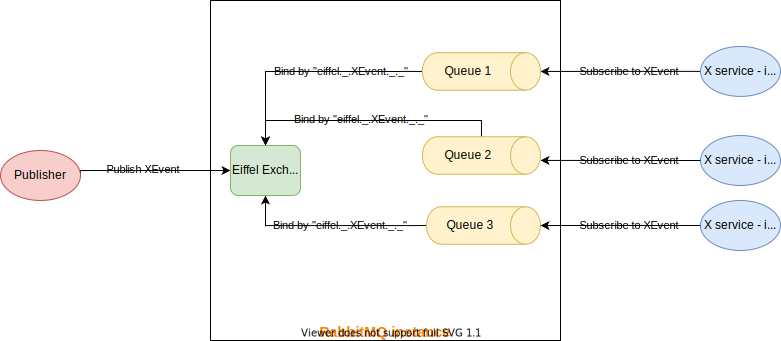
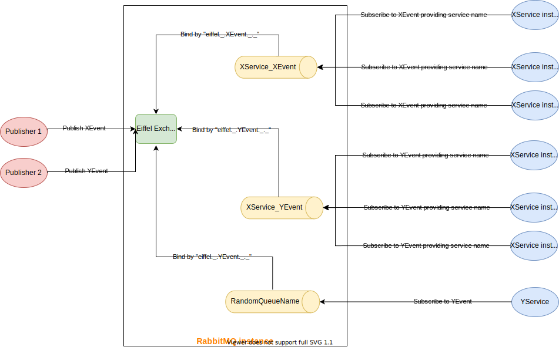

# Architecture: RabbitMQ Communication Design

## Message Broker

Messaging brokers receive messages from *publishers* (applications that publish them, also known as producers) and route them to *consumers* (applications that process them) asynchronously.

Since it is a network protocol, the publishers, consumers, and the broker can all reside on different machines.

## RabbitMQ

[RabbitMQ](https://www.rabbitmq.com/) is lightweight and easy to deploy on-premises and in the cloud message broker. It supports multiple messaging protocols (for example AMQP). RabbitMQ can be deployed in distributed and federated configurations to meet high-scale, high-availability requirements. We used RabbitMQ as an implementer for AMQP (Advanced Message Queuing Protocol). It implements AMQP 0-9-1 (incl. extensions). 

### **What is AMQP 0-9-1?**

[AMQP 0-9-1](https://www.amqp.org/) (Advanced Message Queuing Protocol) is a messaging protocol that enables conforming client applications to communicate with conforming messaging middleware brokers.

#### **AMQP 0-9-1 Model in Brief**

The AMQP 0-9-1 Model has the following view of the world: messages are published to *exchanges*, which are often compared to post offices or mailboxes. Exchanges then distribute message copies to *queues* using rules called *bindings*. Then the broker either delivers messages to consumers subscribed to queues, or consumers fetch/pull messages from queues on demand.

## **Exchange Type**

***Exchanges*** are AMQP 0-9-1 entities where messages are sent to. Exchanges take a message and route it into zero or more queues. The routing algorithm used depends on the ***exchange type*** and rules called ***bindings***. AMQP 0-9-1 brokers provide four exchange types: Direct, Fanout, Topic, and Headers Exchange.

We have chosen the Topic Exchange due to its flexibility in binding with different queues based on the desired event to subscribe to. Hence, Eiffel has a topic per event type. This topic will be used later for binding a queue to an exchange.

EiffelEvent.NET SDK manages a single exchange called “**eiffel**“ for all publishers which will be used for event publishing. This exchange is declared only if it wasn’t already existing in the RabbitMQ instance.


## **Routing Keys**

The routing key is an attribute you have to set while sending a message from a certain publisher. Eiffel library is hiding these details from different library users and we are using a standard routing key that was provided by the Eiffel community through a project called [Eiffel-Sepia](https://eiffel-community.github.io/eiffel-sepia/index.html). 

The pattern of the routing key as per this standard will be as follows:
`eiffel.<family>.<type>.<tag>.<domainId>`

where:

- `family` is the non-empty name of a group of Eiffel events to which the current event belongs. The families have not been defined in [Sepia](https://eiffel-community.github.io/eiffel-sepia/rabbitmq-message-broker.html) but maybe in the future. Our implementations choose to use a fixed string in this field such as `'_'`.
- `type` is the type of the published Eiffel event (i.e. its `meta. type` member), e.g. `EiffelArtifactCreatedEvent`.
- `tag` is an implementation-specific tag. It can be any non-empty string but must not contain a period such as `'_'`.
- `domainId` is the non-empty string representing the domain the event applies to. It corresponds to the `meta.source.domainId` member of an Eiffel event. And it can be replaced by a non-empty string such as `'_'`.

Based on the previous pattern and as per our implementation for it the following is examples of the automatically generated routing keys based on the published events:

- `eiffel._.EiffelActivityTriggeredEvent._._`
- `eiffel._.EiffelActivityStartedEvent._._`

As a result of that, and thanks to AMQP topic exchanges, the consumers can subscribe to a very specific event using its corresponding routing key such as `eiffel._.EiffelActivityTriggeredEvent._._`. Or it can subscribe to all Eiffel events by using wild cards such as `eiffel._.*._._`.

## **Queues**

Queues in the AMQP 0-9-1 model are very similar to queues in other message-queueing systems: they store messages that are consumed by applications (subscribers). Before a queue can be used it has to be declared. Declaring a queue will cause it to be created if it does not already exist. 

Applications may pick queue names or ask the broker to generate a name for them. Queue names may be up to 255 bytes of UTF-8 characters. An AMQP 0-9-1 broker can generate a unique queue name on behalf of an app. To use this feature, pass an empty string as the **service name** argument. The generated name will be returned to the client with a queue declaration response.

In EiffelEvent.NET SDK, and by default, when a service subscribes to an event. EiffelEvent.NET declares a new queue for this service with an auto-generated queue name that is provided by RabbitMQ. This decision has the drawback of creating new queues for scalable services (the same service that scales up due to any reason). So, if we scale up the **XService**, for example, every **XService** instance that subscribes to the same event will have a new queue which will end up in a state that the service will consume the same event more than one time. The following illustration explains this drawback:



As per the previous illustration, XEvent will be consumed three times by the same scaled service (**XService**) and that may cause problems due to event processing duplications. 

Based on that, we provided a solution to create only one queue for each unique service. But how we can accomplish that if we are letting RabbitMQ generate queue names for us?

### Scalability Support

We implemented a design that allows subscribers to optionally pass a service name (which will be a queue identifier for this service). If the subscriber service passed the service name, the Eiffel library will generate the queue name and pass it to the RabbitMQ to declare the queue with the provided name. If the queue was already declared, RabbitMQ will not declare a new queue but it will make the new instance of Flower service consume from the same created queue. For more clarification, review the below illustration.



Queue name will be auto-generated with the following pattern: `"{serviceName}_{eventName}"` where `serviceName` e.g. XService and `eventName` is the type of event that the service will subscribe to (e.g. EiffelActivityTriggeredEvent), so the queue name that will be generated by the SDK will be such as `XService_EiffelActivityTriggeredEvent`.

As a result of that design, once an event is published to a certain Topic (XEvent), only one **XService** instance will process that event hence RabbitMQ will push the messages from the queue to the service using a round-robin pattern. Once the event will be dequeued by a service instance (XService instance 1), the other two instances will not be able to process that event.

### Queues Durability
We have designed our RabbitMQ client to declare queues using the following parameters:
- `durable: true` => configure declared queue as durable after RabbitMQ instance restart.
- `exclusive: false` => configure declared queue as persistent after the declaring connection is closed.
- `autoDelete: false` => configure declared queue as persistent after the consumer unsubscribes.

This will make the consumer capable of consuming events published in its downtime as the queue will be durable and messages will be persistent on RabbitMQ instance. 


## `RabbitMqEiffelClient`

`RabbitMqEiffelClient` is the core class used for assisted publishing and subscribing to RabbitMQ, it implements the `IEiffelClient` interface which resides in the **EiffelEvents** package, and sets the contract for Eiffel Clients classes such as `RabbitMqEiffelClient`.

It provides the following functionalities:

### Client Configuration
#### RabbitMQ Configuration

`RabbitMqEiffelClient` initiates RabbitMQ connection based on `RabbitMqConfig` passed to its constructor, for example

```
// Init client
IEiffelClient eiffelClient = new RabbitMqEiffelClient(new ClientConfig()
{
    RabbitMqConfig = new()
    {
        HostName = "localhost",
        UserName = "admin",
        Password = "admin",
        Port = 5672
    },
    ValidationConfig = new ()
    {
        ...
    }
}, 1);
```

#### Validation Configuration

- `SchemaValidationOnPublish`: Set whether to validate against JSON schema before publish or not. Eligible values: 
  - `ON`: Validate before publish.
  - `OFF`: Publish without validation.
- `SchemaValidationOnSubscribe`: Set whether to validate against JSON schema while subscribing to an event. Eligible values: 
  - `NONE`: Never validate upcoming event against JSON schema.
  - `ON_DESERIALIZATION_FAIL`: Validate upcoming event against JSON schema only if deserialization failed.
  - `ALWAYS`: Always validate upcoming event against JSON schema.

Example:

```
// Init client
IEiffelClient eiffelClient = new RabbitMqEiffelClient(new ClientConfig()
{
    RabbitMqConfig = new()
    {
        ...
    },
    ValidationConfig = new ()
    {
         SchemaValidationOnPublish = SchemaValidationOnPublish.ON,
         SchemaValidationOnSubscribe = SchemaValidationOnSubscribe.ALWAYS
    }
}, 1);
```

### Publish

Publish an event to the Eiffel message queue represented by this client. The `Publish` method has the following signature:

```c#
Result<T> Publish<T>(T eiffelEvent, SchemaValidationOnPublish validateOnPublish) where T : IEiffelEvent;
```

where: 

- `T`: The type of event to be sent.
- `eiffelEvent`: Event object to be sent on the message bus. This object will be serialized to JSON format and then will be published to RabbitMQ.
- `validateOnPublish`: indicate that if the event will be validated before publish or not. This parameter will override any configured value.
- `Result<T>`:  Result object that indicates if the event was published successfully (`Result.IsSuccess`).  It may hold validation errors in case of failed event validation (`Result.IsFailed`). If publish succeed, the result object will hold the event sent on the bus, which may be different from the input event (e.g. signed).

Note: the following overload also exist for `Publish` but `SchemaValidationOnPublish` will be `ON` by default configurations if user didn't pass it in `ClientConfig`, otherwise, it will depend on  the value configured in `ClientConfig` that passed to the constructor of `RabbitMqEiffelClient`:
```c#
Result<T> Publish<T>(T eiffelEvent) where T : IEiffelEvent;
```

### Subscribe

Subscribes to events of the given type (the given topic). the `Subscribe` method has the following signature:

```c#
string Subscribe<T>(string serviceIdentifier, Action<Result<T>, ulong> callback, SchemaValidationOnSubscribe validateOnSubscribe) where T : IEiffelEvent, new();
```

where: 

- `Result<T>`: Fluent result object of subscribed event. `IsSuccess` flag will be `true` if the received JSON was a valid event according to the respective schema and the event object can be found in `Value` property. `IsSuccess` flag will be `false` if the received JSON wasn't valid according to the respective schema and the validation errors can be found using `Errors` property.
- `serviceIdentifier`: string identifier for each service to be included in queue name. If was passed as `string.Empty`, the queue name will be auto-generated by RabbitMQ.
- `callback`: Callback that will be invoked when new events are received where `T` is the event object and `ulong` for `deliveryTag` which will be used afterward to `ack` or `reject` a message.
- `validateOnSubscribe`: States when to validate the received JSON event.
- Returns `string` for `subscriptionId` can later be used to `UnSubscribe`.

Note: the following overload also exist for `Subscribe` but `SchemaValidationOnSubscribe` will be `NONE` by default configurations if user didn't pass it in `ClientConfig`, otherwise, it will depend on the value configured in `ClientConfig` that passed to the constructor of `RabbitMqEiffelClient`
```c#
string Subscribe<T>(string serviceIdentifier, Action<Result<T>, ulong> callback) where T : IEiffelEvent, new();
```

***Note:** all events (i.e. messages) that will be processed must be acknowledged if the processing is done successfully or rejected if any unhandled situation happens while processing.*

### Ack

Acknowledge receiving the message (event), used for positive acknowledgments. The `ack` method has the following signature:

```c#
void Ack(ulong deliveryTag);
```

where: 

- `deliveryTag`: A growing positive integer uniquely identifies the delivery on a channel that will be generated by RabbitMQ.

### Reject

Reject the message (event), used for negative acknowledgments. The `Reject` method has the following signature:

```c#
void Reject(ulong deliveryTag, bool requeue);
```

where: 

- `deliveryTag`: A growing positive integer uniquely identifies the delivery on a channel that will be generated by RabbitMQ.
- `requeue`: Flag to add the message again to the queue or not. RabbitMQ will try to add this message to the closest position of its original one in the queue.

***Note:** When there is only one consumer on a queue, make sure you do not create infinite message delivery loops by rejecting and requeueing a message from the same consumer over and over again.*

### Unsubscribe

Cancel subscription. The `Unsubscribe` method has the following signature: 

```c#
void Unsubscribe(string subscriptionId);
```

where: 

- `subscriptionId`: is a subscription ID for a consumer it is returned by `Subscribe` method on the callback.

## RabbitMqWrapper

`RabbitMqWrapper` as its name implies, wraps and abstract all RabbitMQ client functionality to `RabbitMqEiffelClient`
to ease further updates and maintainability.

## Exception

Based on the exception hierarchy defined in the **EiffelEvents** package, the **EiffelEvents.Clients.RabbitMq** package provides `RabbitMqException` that raised to handle and wrap RabbitMQ communication errors.

```c#
public class RabbitMqException : EiffelException
{    
    public override ExceptionSource RaisedBy => ExceptionSource.MessageBroker;
}
```

For instance when initiates connection to RabbitMQ instance

```c#
try
{
    _connection = InitConnection(rabbitMqConfig, connectionRetries);
    _channel = CreateChannel(_connection);
    _config = rabbitMqConfig;
}
catch (Exception e)
{
    throw new RabbitMqException("An error occured while initializing RabbitMQ client", e);
}
```

## 
