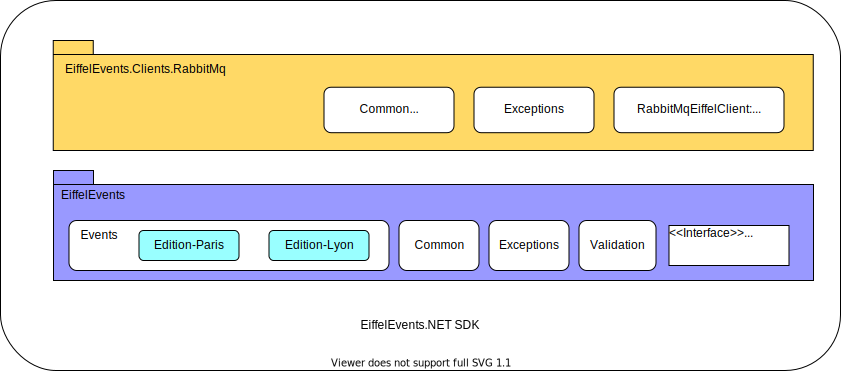

# System Architecture

This page describes the EiffelEvents.NET SDK system architecture and main design decisions.

## High-Level architecture

EiffelEvents.NET SDK high-level architecture consists of two main parts: **EiffelEvents** vocabulary implementation and the assisted publishing client to a message broker, RabbitMQ called **EiffelEvents.RabbitMq.Client**. The two parts are separated .NET class library projects which could be packaged and published individually so users may use the **EiffelEvents** package for strongly-typed validated Eiffel events alone. 



## EiffelEvents

EiffelEvents package has Eiffel events implementation, and their validation, main events security logic. Eiffel events are categorized by their edition under namespaces in the **Events** directory, where each edition has its own namespace. For instance Edition-Paris and Edition-Lyon for Eiffel events for Paris and Lyon edition respectively.

For more details check the [Implement Events Checklist](implement-event.md)

## 

- Events validation is declarative by using attribute validation, hence the events are considered as a domain class, which is self-contained for their definition and validation.

```c#
[NestedObject]
[Required(AllowEmptyStrings = false)]
public EiffelOutcome Outcome { get; init; }
```

- Custom call to Validate method return the validation Result object.

```c#
public Result Validate()
    
```

It is also called according to options parameter in Publish in the **EiffelEvents.RabbitMq.Client** package

```c#
public Result<T> Publish<T>(T eiffelEvent, bool validateBeforePublish = true)
...
```

- Validation Result: events validation results are reported by the returned object of `Result<T>` using **FluentResult **: An external library for  [Result](https://github.com/altmann/FluentResults) object implementation with cumulative errors.

## Exceptions

  - For exceptional situations that could not be handled like `EiffelSecurityException` or Message Broker exceptions, an exception hierarchy is developed to handle such exceptions and raise meaningful messages.

   ```c#
public abstract class EiffelException : Exception
 {    ...
     /// <summary>
     /// Source of exception raising either EiffelLibrary or MessageBroker.
     /// </summary>
     public virtual ExceptionSource RaisedBy => ExceptionSource.EiffelLibrary;
 }
   ```

  - Library Exception

   ```c#
 public class EiffelSecurityException : EiffelException
 {
     public EiffelSecurityException(string message) : base(message)
     {
     }
 }
   ```

​    

## Security

EiffelEvents.NET SDK implements [data integrity](https://github.com/eiffel-community/eiffel/blob/edition-paris/eiffel-syntax-and-usage/security.md#integrity) as one of the security concerns that ensure the accuracy and completeness of data and are supported by the Eiffel protocol. This security task is achieved through a digital signature.

> The Eiffel protocol's support is influenced by [JSON Web Signatures (JWS)](https://tools.ietf.org/html/rfc7515), with slight modifications to allow the inclusion of the signature within the event message itself, rather than as part of a header. 

### Integrity Implementation

Eiffel protocol is implementing the integrity protection of event objects using `meta.security.integrityProtection` property in every event object. 

> This is an optional object for enabling information integrity protection via cryptographic signing. To generate a correct `meta.security.integrityProtection` object:
>
> 1. Generate the entire event, but with the `meta.security.integrityProtection.the signature` value set to an empty string.
>
> 2. Serialize the event on [Canonical JSON Form](https://tools.ietf.org/html/draft-staykov-hu-json-canonical-form-00). The canonical JSON format for serialization is to serialize C# object to JSON form without any indentation such as the following: 
>
>    ```json
>    {"abc":"def","foo":"bar","zoo":["def","abc"]}
>    ```
>
> 3. Generate the signature using the `meta.security.integrityProtection.alg` algorithm.
>
> 4. Set the `meta.security.integrityProtection.signature` value to the resulting signature while maintaining Canonical JSON Form. 
>
> 5. To verify the integrity of the event, the consumer then resets `meta.security.integrityProtection.signature` to an empty string and ensures Canonical JSON Form before verifying the signature.

### Digital Signature Generation Process


### IntegrityProtection object anatomy

`IntegrityProtection `object anatomy is as follows:

```c#
public record EiffelIntegrityProtection
{ 
public string Alg { get; init; } 
public string Signature { get; init; }
public string PublicKey { get; init; } 
}
```

where: 

- `Alg`: [A valid JWA RFC 7518 alg parameter value](https://tools.ietf.org/html/rfc7518#section-3.1), excluding "none". The cryptographic algorithm will be used to digitally sign the event. If no signing is performed, the `meta.security.integrityProtection` SHALL be omitted rather than setting `meta.security.integrityProtection.alg` to "none". Our implementation uses the “*RS256*“ algorithm to generate the digital signature. This algorithm uses the “RSA“ algorithm as the encryption algorithm and “SHA256“ as the hashing algorithm.
- `Signature`: The signature produced by the signing algorithm.
- `PublicKey`: The producer of the event may include the relevant public key for convenience, rather than relying on a separate key distribution mechanism. Note that this property, along with the rest of the event, is encompassed by the integrity protection offered via `meta.security.integrityProtection`. This key can be used only for validating the signature as it can only decrypt the signature. Decrypting the signature will produce a SHA256 hash value of the JSON string in canonical form, without setting the signature property. To verify the signature, the consumer has to hash the received JSON string using the SHA256 algorithm and then validate the signature using this public key against the hashed value.

### Verify Signature Process


## Protocol Versions Support

- Eiffel Protocol Editions Stepping: each edition has its own namespace, We started with `edition-Paris`, as a stable version, then implemented `edition-Lyon`

- Event Versioning:

  - **Same Edition:** As stated in the [Eiffel versioning](https://github.com/eiffel-community/eiffel/blob/master/eiffel-syntax-and-usage/versioning.md)

    individual event updated will be stepped by increment edition name `<baseline edition name>-<increment integer starting at 1>`  e.g. `edition-Paris` would be `edition-Paris-1`, hence it will be residing in its new namespace.

  - **New Edition:**

    - new namespace:
      - For a major change of events a new implementation will be done (may copy some properties from the previous one)
      - Event with no changes will be aliased, by inheriting the last version from the previous edition, so it will exist under the new namespace for a better developer experience.


