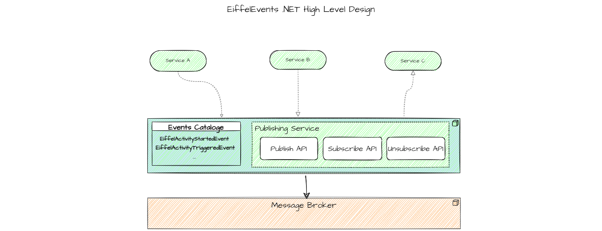

# EiffelEvents.Net SDK

## Overview

The integration between distributed services such as Continuous Delivery (CD)  services, is done through messaging service, as a kind of asynchronous communication. CD services have special common events to communicate. To communicate these events across multiple CD systems,  there is a need for a unified/standard communication mechanism for events' vocabularies.

For that unification/standardization reason the CD community has invented two-CD communication protocols: 

- [Eiffel Protocol](https://github.com/eiffel-community/eiffel)
- [CDF Events Standards](https://github.com/cdfoundation/sig-events)

Message brokers such as RabbitMQ are general-purpose messaging services, however, for supporting the above CD events standardization there is a need for strongly-typed events implementation and providing an intermediate Event Publishing service that exists in front of these message brokers to :

1. Implement the above protocols' Event vocabularies and 
2. Provide a level of abstraction for the Event author (publisher) or consumer (subscriber).

## Context and goals

EiffelEvents.Net SDK is a .NET implementation for Eiffel events and  Assisted publishing service, which acts as an intermediate between the event author (publisher) and the Message Broker (RabbitMQ for instance).

> In Assisted Publishing, actors do not publish events directly to the [RabbitMQ Message Broker](https://eiffel-community.github.io/eiffel-sepia/rabbitmq-message-broker.html), but via an [Event Publishing](https://eiffel-community.github.io/eiffel-sepia/event-publishing.html) service.

## Features

EiffelEvents.Net SDK consists of two packages:

1. **EiffelEvents.Net** for Eiffel's events' implementation.
2. **EiffelEvents.RabbitMq.Client** for assisted publishing to RabbitMQ.

which support the following features:

- Implement Eiffel events vocabularies as described in [Eiffel protocol](https://github.com/eiffel-community).
- Validate events' schema regarding target event’s version.
- Sign and verify events' signatures.
- Serialization/deserialization of events.
- Provide  APIs for users to publish, subscribe, acknowledge, reject and unsubscribe for strongly-typed Eiffel events to RabbitMQ.

## Tools & Technologies

- .NET 6: which supports C# 9.0 as long as it will be Long-Time Support (LTS) version of .NET.
- C# 9.0: which has features such as record [type ](https://docs.microsoft.com/en-us/dotnet/csharp/whats-new/csharp-9#record-types)which provides Immutability and Value equality.
